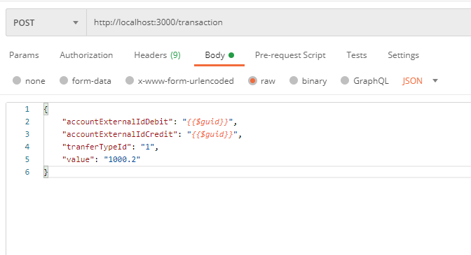
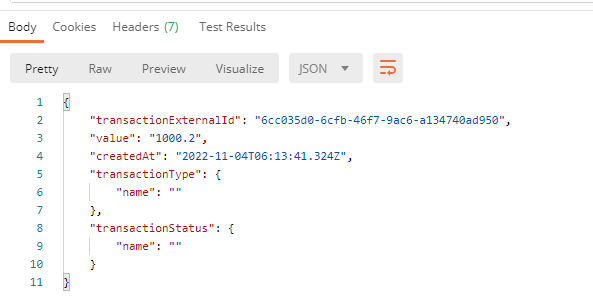
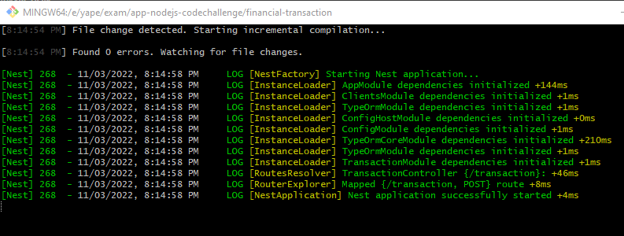
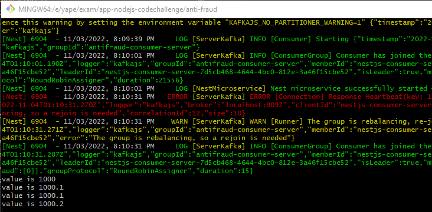
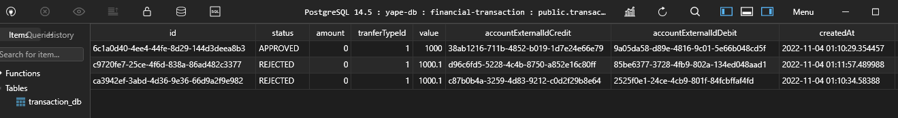

<p align="center">
  
</p>

## Description

Financial transaction, 
* Save transaction on status PENDING on DB, (postgres)
* Send to antifraud validation amount, return status REJECTED when the amount is major to 1000, otherwise is APPROVED
* Update transaction with status response of antifraud


## Tools

```
Nest
TypeOrm
KafkaJs
Postgres
Docker
```

## End Point

```
curl --location --request POST 'http://localhost:3000/transaction' \
--header 'Content-Type: application/json' \
--data-raw '{
    "accountExternalIdDebit": "0af93596-0755-491c-b0e1-932924c39142",
    "accountExternalIdCredit": "53451e6c-18d3-499e-9f66-7916b13373e7",
    "tranferTypeId": "1",
    "value": "1000.2"
}'

```


## Start Project

```bash
$ yarn start:dev
```

## Images

Postman / Request
<p align="left">
  
</p>

Postman / Response
<p align="left">
  
</p>


Financial Transaction
<p align="left">
  
</p>


Anti Fraud
<p align="left">
  
</p>


Postgres
<p align="left">
  
</p>


